# Architecture — Voice-First AI Property Scout

## 1. High-Level System Overview

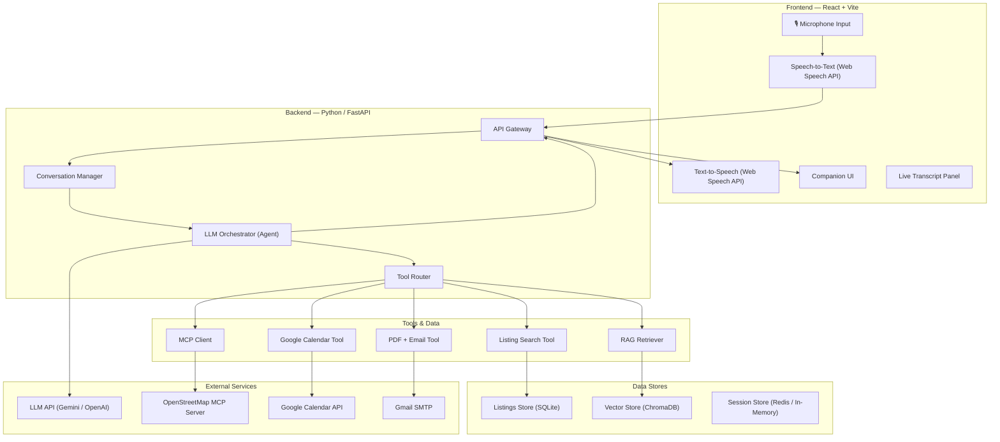

---

## 2. Technology Stack

| Layer | Technology | Rationale |
|-------|-----------|-----------|
| **Frontend** | React + Vite | Fast dev server, modern tooling, easy deployment |
| **Styling** | Vanilla CSS | Full control, no framework overhead |
| **Voice Input (STT)** | Web Speech API | Browser-native, zero cost, works in Chrome/Edge |
| **Voice Output (TTS)** | Web Speech API | Browser-native, zero cost |
| **Backend** | Python + FastAPI | Async, great LLM ecosystem, fast prototyping |
| **LLM** | Google Gemini 2.0 Flash | Cost-effective, function calling support, fast |
| **MCP Client** | `mcp` Python SDK | Official SDK for MCP protocol |
| **Vector Store (RAG)** | ChromaDB | Lightweight, local, no infra needed for 3 neighborhoods |
| **Embeddings** | `text-embedding-004` (Google) / `text-embedding-3-small` (OpenAI) | High quality, affordable |
| **Listings DB** | SQLite | 15 listings — no need for a full DB server |
| **Session State** | In-memory (dict) | Simple for prototype; Redis if scaling |
| **PDF Generation** | WeasyPrint / ReportLab | Free, Python-native, no external service needed |
| **Email** | Gmail SMTP (smtplib) | Free, built into Python stdlib |
| **Booking** | Google Calendar API | Free, creates real calendar events for site visits |
| **Deployment** | Vercel (frontend) + Railway/Render (backend) | Free tiers, public URLs, easy CI/CD |

---

## 3. Component Architecture

### 3.1 Frontend — Companion UI

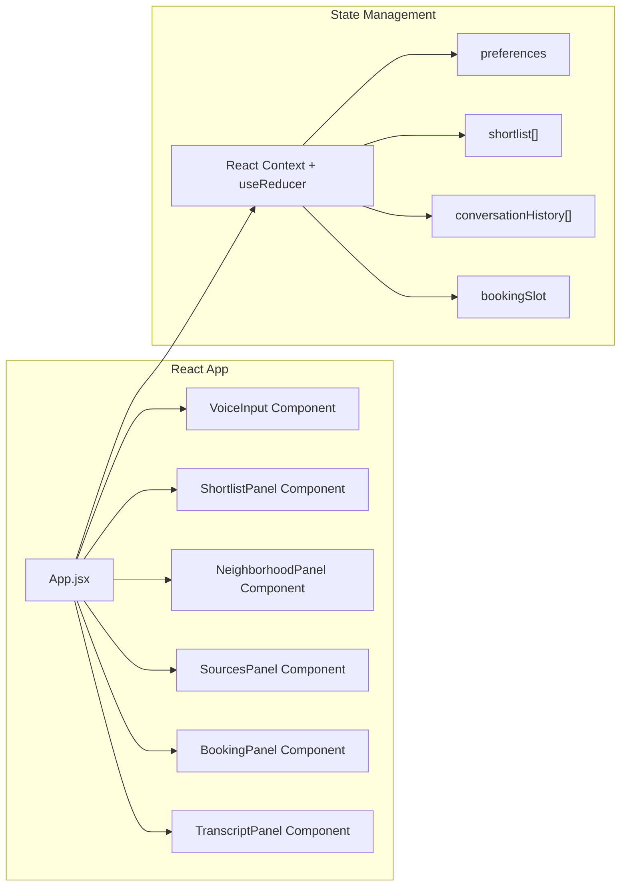

#### UI Components

| Component | Responsibility |
|-----------|---------------|
| **`VoiceInput`** | Mic button, STT integration, sends transcript to backend |
| **`TranscriptPanel`** | Live scrolling transcript of the conversation |
| **`ShortlistPanel`** | Renders listing cards (rent, BHK, area, amenities) |
| **`NeighborhoodPanel`** | Snapshot per listing — transit, safety, amenities from OSM + RAG |
| **`SourcesPanel`** | Citations for every neighborhood claim, linked to RAG sources |
| **`BookingPanel`** | Visit-confirmation with slot picker and confirmation code |

#### Voice Flow (Frontend)

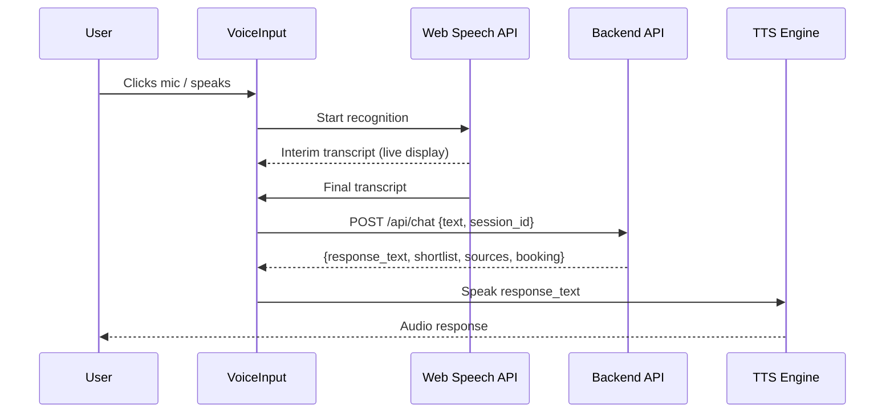

---

### 3.2 Backend — FastAPI Server

```
backend/
├── main.py                    # FastAPI app entry point
├── api/
│   ├── routes/
│   │   ├── chat.py            # POST /api/chat — main conversation endpoint
│   │   ├── listings.py        # GET /api/listings — fetch all listings
│   │   ├── booking.py         # POST /api/booking — book via Google Calendar
│   │   └── shortlist_pdf.py   # POST /api/shortlist/pdf — generate PDF + email
│   └── middleware/
│       └── cors.py            # CORS config for frontend
├── core/
│   ├── orchestrator.py        # LLM Agent — intent routing + tool calling
│   ├── conversation.py        # Conversation state manager
│   └── prompt_templates.py    # System prompts, few-shot examples
├── tools/
│   ├── listing_search.py      # Search/filter listings from SQLite
│   ├── mcp_client.py          # OpenStreetMap MCP integration
│   ├── rag_retriever.py       # ChromaDB vector search for neighborhood data
│   ├── google_calendar.py     # Google Calendar API integration
│   ├── pdf_generator.py       # WeasyPrint shortlist PDF generation
│   └── email_sender.py        # Gmail SMTP email sending
├── data/
│   ├── listings.json          # Scraped, cleaned listings (15 max)
│   ├── neighborhoods/         # Raw neighborhood guide text files
│   │   ├── koramangala.txt
│   │   ├── indiranagar.txt
│   │   └── hsr_layout.txt
│   └── seed_db.py             # Script to populate SQLite + ChromaDB
├── evals/
│   ├── feasibility_eval.py    # Budget & must-haves compliance
│   ├── edit_correctness.py    # Voice edit precision
│   ├── grounding_eval.py      # Hallucination detection
│   └── run_evals.py           # CLI runner for all evals
├── config.py                  # API keys, model config, MCP server URL
└── requirements.txt
```

---

### 3.3 LLM Orchestrator (Agent)

The core of the system — an **agentic LLM loop** that interprets user intent and dispatches tool calls.

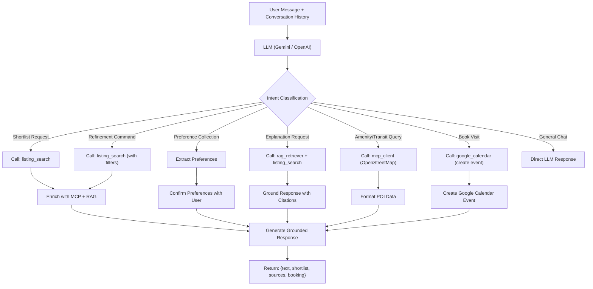

#### Tool Definitions (Function Calling Schema)

```python
tools = [
    {
        "name": "search_listings",
        "description": "Search and filter property listings by budget, bedrooms, amenities, neighborhood",
        "parameters": {
            "max_budget": "int — maximum monthly rent",
            "min_bedrooms": "int — minimum bedrooms (1, 2, 3)",
            "neighborhood": "str — area name (e.g. Koramangala)",
            "amenities": "list[str] — required amenities (parking, balcony, gym, etc.)",
            "exclude_ids": "list[str] — listing IDs to exclude from results",
            "mode": "replace (new search) | append (add to what's on screen)",
            "limit": "int — at most this many results ('add one more' = 1)"
        }
    },
    {
        "name": "update_shortlist",
        "description": "Narrow the on-screen shortlist on ANY criterion by removing listings by ID",
        "parameters": {
            "remove": "list[{listing_id: str, reason: str}] — only on-screen IDs accepted; reasons shown in the UI"
        }
    },
    {
        "name": "query_openstreetmap",
        "description": "Query nearby amenities, transit points, and POIs around a location using OpenStreetMap MCP",
        "parameters": {
            "latitude": "float",
            "longitude": "float",
            "radius_meters": "int — search radius (default 1000)",
            "poi_types": "list[str] — e.g. ['metro_station', 'hospital', 'grocery', 'restaurant']"
        }
    },
    {
        "name": "retrieve_neighborhood_info",
        "description": "Retrieve grounded neighborhood guidance from RAG (safety, character, livability)",
        "parameters": {
            "neighborhood": "str — neighborhood name",
            "query": "str — specific aspect to retrieve (e.g. 'safety at night', 'food scene')"
        }
    },
    {
        "name": "book_site_visit",
        "description": "Book a site visit by creating a Google Calendar event with listing details",
        "parameters": {
            "listing_id": "str",
            "preferred_date": "str — ISO date",
            "preferred_time_slot": "str — morning / afternoon / evening",
            "user_email": "str — attendee email (receives calendar invite)"
        }
    },
    {
        "name": "generate_shortlist_pdf",
        "description": "Generate a PDF of the shortlist and email it to the user via Gmail SMTP",
        "parameters": {
            "shortlist_ids": "list[str]",
            "user_email": "str"
        }
    }
]
```

---

### 3.4 MCP Integration — OpenStreetMap

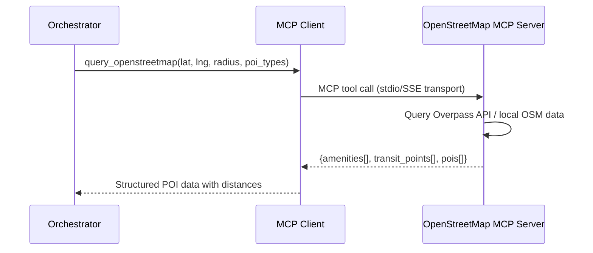

#### Integration Details

| Aspect | Detail |
|--------|--------|
| **MCP Server** | [open-streetmap-mcp](https://github.com/jagan-shanmugam/open-streetmap-mcp) |
| **Transport** | stdio (local) or SSE (remote) |
| **Client SDK** | `mcp` Python package |
| **When Called** | During shortlist enrichment, commute queries, "what's nearby?" questions |
| **Data Returned** | Nearby metro stations, hospitals, groceries, restaurants, parks, schools with distances |
| **Caching** | Cache results per (lat, lng, radius) tuple — POI data doesn't change frequently |

#### MCP Client Implementation Sketch

```python
# tools/mcp_client.py
from mcp import ClientSession, StdioServerParameters
from mcp.client.stdio import stdio_client

class OpenStreetMapMCP:
    def __init__(self):
        self.server_params = StdioServerParameters(
            command="npx",
            args=["-y", "open-streetmap-mcp"]
        )
    
    async def query_nearby(self, lat: float, lng: float, radius: int, poi_types: list[str]):
        async with stdio_client(self.server_params) as (read, write):
            async with ClientSession(read, write) as session:
                await session.initialize()
                result = await session.call_tool(
                    "search_nearby",
                    arguments={
                        "latitude": lat,
                        "longitude": lng,
                        "radius": radius,
                        "tags": poi_types
                    }
                )
                return self._parse_results(result)
```

---

### 3.5 RAG Pipeline — Neighborhood Knowledge

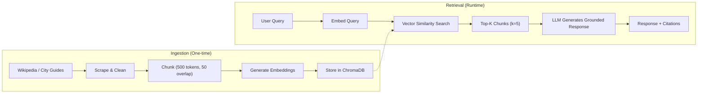

#### RAG Details

| Aspect | Detail |
|--------|--------|
| **Sources** | Wikipedia pages for Koramangala, Indiranagar, HSR Layout (3 neighborhoods) |
| **Chunking** | 500 tokens per chunk, 50-token overlap, split on paragraph boundaries |
| **Embedding Model** | `text-embedding-004` (Google) — 768 dimensions |
| **Vector Store** | ChromaDB (local, persistent) |
| **Retrieval** | Top-5 chunks by cosine similarity |
| **Citation Format** | Each chunk stores `{source_url, section_title, paragraph_index}` as metadata |
| **Grounding Rule** | LLM prompt enforces: *"Only use information from the provided context. If the context doesn't contain relevant information, say you don't have data on that."* |

---

### 3.6 Conversation State Machine

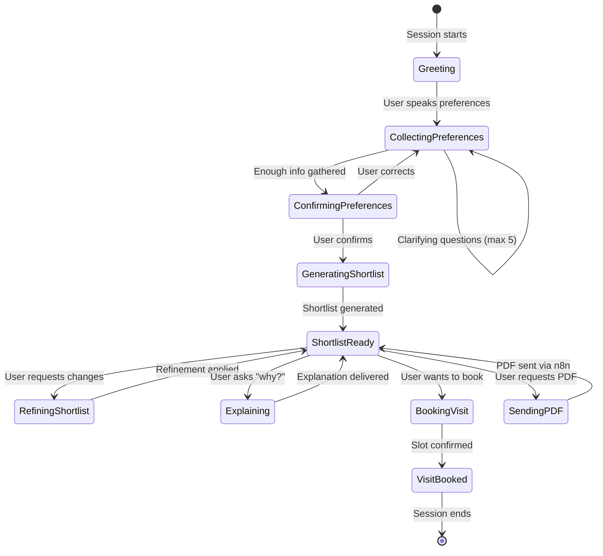

#### Conversation State Schema

```python
@dataclass
class ConversationState:
    session_id: str
    state: str  # greeting | collecting | confirming | shortlist_ready | booking | ...
    preferences: UserPreferences
    shortlist: list[Listing]
    conversation_history: list[Message]
    clarification_count: int  # max 5
    booking: BookingSlot | None

@dataclass
class UserPreferences:
    budget_max: int | None
    bedrooms: int | None
    neighborhood: str | None
    must_have_amenities: list[str]
    commute_point: str | None  # e.g. "MG Road metro"
    nice_to_haves: list[str]
```

---

### 3.7 Google Calendar Integration (Booking)

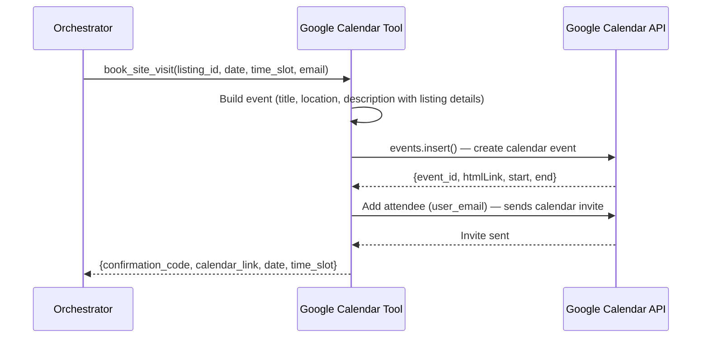

#### Integration Details

| Aspect | Detail |
|--------|--------|
| **API** | Google Calendar API v3 (free) |
| **Auth** | Service Account with domain-wide delegation, or OAuth2 consent flow |
| **Python SDK** | `google-api-python-client` + `google-auth` |
| **Event Fields** | Title: "Site Visit — {society_name}", Location: listing address, Description: listing details + shortlist link |
| **Attendees** | User's email → receives a Google Calendar invite automatically |
| **Confirmation** | Returns event ID as confirmation code + direct calendar link |

#### Implementation Sketch

```python
# tools/google_calendar.py
from googleapiclient.discovery import build
from google.oauth2.service_account import Credentials

SCOPES = ["https://www.googleapis.com/auth/calendar"]

class GoogleCalendarBooking:
    def __init__(self, service_account_file: str, calendar_id: str):
        creds = Credentials.from_service_account_file(service_account_file, scopes=SCOPES)
        self.service = build("calendar", "v3", credentials=creds)
        self.calendar_id = calendar_id

    def book_visit(self, listing: dict, date: str, time_slot: str, user_email: str):
        start, end = self._resolve_time_slot(date, time_slot)
        event = {
            "summary": f"Site Visit — {listing['society_name']}",
            "location": f"{listing['neighborhood']}, Bengaluru",
            "description": f"Property: {listing['bedrooms']}BHK, ₹{listing['rent']}/mo\n"
                           f"Amenities: {', '.join(listing['amenities'])}",
            "start": {"dateTime": start, "timeZone": "Asia/Kolkata"},
            "end": {"dateTime": end, "timeZone": "Asia/Kolkata"},
            "attendees": [{"email": user_email}],
            "reminders": {"useDefault": True},
        }
        result = self.service.events().insert(
            calendarId=self.calendar_id, body=event, sendUpdates="all"
        ).execute()
        return {
            "confirmation_code": result["id"],
            "calendar_link": result["htmlLink"],
            "date": date,
            "time_slot": time_slot,
        }
```

---

### 3.8 PDF Generation & Email (Direct API)

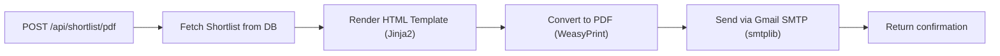

| Step | Library | Detail |
|------|---------|--------|
| 1 | **SQLite** | Fetch full listing details by IDs |
| 2 | **Jinja2** | Render shortlist as styled HTML (cards layout) |
| 3 | **WeasyPrint** | Convert HTML → PDF document |
| 4 | **smtplib** | Send PDF as email attachment via Gmail SMTP (free) |

---

## 4. Data Flow — End-to-End Request

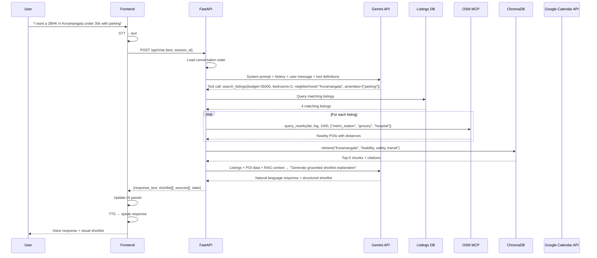

---

## 5. API Contracts

### `POST /api/chat`

**Request:**
```json
{
    "session_id": "uuid-string",
    "text": "I want a 2BHK in Koramangala under 35k with parking",
    "timestamp": "2026-09-04T23:30:00Z"
}
```

**Response:**
```json
{
    "session_id": "uuid-string",
    "response_text": "I found 4 listings in Koramangala within your budget...",
    "state": "shortlist_ready",
    "shortlist": [
        {
            "id": "listing_001",
            "society_name": "Prestige Ozone",
            "neighborhood": "Koramangala",
            "rent": 32000,
            "bedrooms": 2,
            "sqft": 1100,
            "furnishing": "semi-furnished",
            "amenities": ["parking", "gym", "power_backup"],
            "latitude": 12.9352,
            "longitude": 77.6245,
            "nearby_pois": {
                "metro_stations": [{"name": "Indiranagar Metro", "distance_km": 2.1}],
                "groceries": [{"name": "More Supermarket", "distance_km": 0.4}]
            },
            "neighborhood_snapshot": {
                "summary": "Koramangala is one of Bangalore's most popular residential areas...",
                "safety": "Generally considered safe; well-lit main roads...",
                "transit": "No direct metro access yet; BMTC buses on 80 Feet Road..."
            },
            "match_reasons": ["Within budget", "Has parking", "2BHK match"],
            "sources": [
                {"text": "Koramangala is a neighbourhood in Bangalore...", "url": "https://en.wikipedia.org/wiki/Koramangala", "section": "Overview"}
            ]
        }
    ],
    "sources": [
        {"url": "https://en.wikipedia.org/wiki/Koramangala", "title": "Koramangala - Wikipedia", "used_for": "Neighborhood character and safety notes"}
    ],
    "booking": null
}
```

### `POST /api/booking` (Google Calendar)

**Request:**
```json
{
    "session_id": "uuid-string",
    "listing_id": "listing_001",
    "preferred_date": "2026-09-10",
    "preferred_time_slot": "morning",
    "user_email": "user@example.com"
}
```

**Response:**
```json
{
    "confirmation_code": "abc123eventid",
    "calendar_link": "https://calendar.google.com/calendar/event?eid=...",
    "listing_id": "listing_001",
    "date": "2026-09-10",
    "time_slot": "10:00 AM - 12:00 PM",
    "status": "confirmed",
    "message": "Calendar invite sent to user@example.com"
}
```

### `POST /api/shortlist/pdf` (Direct API)

**Request:**
```json
{
    "session_id": "uuid-string",
    "shortlist_ids": ["listing_001", "listing_003"],
    "user_email": "user@example.com"
}
```

**Response:**
```json
{
    "status": "sent",
    "message": "PDF shortlist emailed to user@example.com"
}

---

## 6. Data Pipeline — Listings Scraping & Ingestion

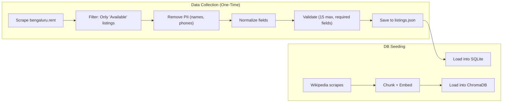

### Listings Schema (SQLite)

```sql
CREATE TABLE listings (
    id TEXT PRIMARY KEY,
    society_name TEXT NOT NULL,
    neighborhood TEXT NOT NULL,
    rent INTEGER NOT NULL,
    bedrooms INTEGER NOT NULL,
    sqft INTEGER,
    furnishing TEXT,          -- unfurnished | semi-furnished | fully-furnished
    amenities TEXT,           -- JSON array
    latitude REAL NOT NULL,
    longitude REAL NOT NULL,
    availability TEXT,        -- available | not_for_rent
    source_url TEXT,
    scraped_at TEXT
);
```

---

## 7. Evaluation Architecture

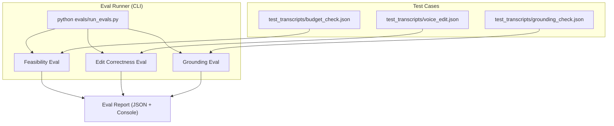

### Eval Details

| Eval | Type | What It Checks | Pass Criteria |
|------|------|----------------|---------------|
| **Feasibility** | Rule-based | All shortlisted listings ≤ budget; required amenities present | 100% compliance |
| **Edit Correctness** | Rule-based + LLM | After "drop above 40k", no listing > 40k remains; unchanged listings are identical | No unintended mutations |
| **Grounding** | LLM-assisted | Every neighborhood claim maps to a RAG chunk; no claims without citations | Zero un-cited claims |

### Sample Test Transcript Format

```json
{
    "test_id": "feasibility_001",
    "description": "Budget constraint compliance",
    "turns": [
        {"role": "user", "text": "I want a 2BHK under 30k in Koramangala"},
        {"role": "assistant", "text": "...", "shortlist": ["listing_001", "listing_005"]},
        {"role": "user", "text": "Drop anything above 25k"},
        {"role": "assistant", "text": "...", "shortlist": ["listing_005"]}
    ],
    "assertions": [
        {"type": "all_within_budget", "budget": 30000, "turn": 1},
        {"type": "all_within_budget", "budget": 25000, "turn": 3},
        {"type": "no_unintended_removals", "turn": 3, "expected_kept": ["listing_005"]}
    ]
}
```

---

## 8. Deployment Architecture

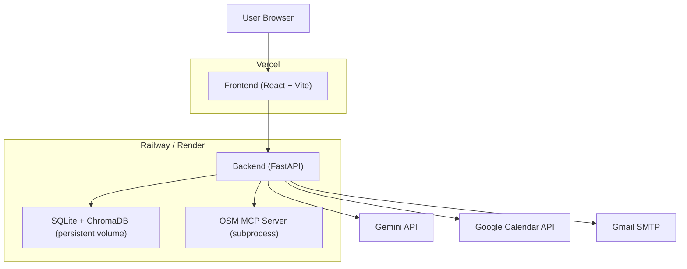

| Component | Platform | URL Pattern |
|-----------|----------|-------------|
| Frontend | Vercel | `https://property-scout.vercel.app` |
| Backend | Railway / Render | `https://property-scout-api.up.railway.app` |

### Environment Variables

```env
# LLM
GEMINI_API_KEY=...
# or
OPENAI_API_KEY=...

# Google Calendar
GOOGLE_SERVICE_ACCOUNT_FILE=service-account.json
GOOGLE_CALENDAR_ID=primary

# Email (Gmail SMTP — free)
SMTP_HOST=smtp.gmail.com
SMTP_PORT=587
SMTP_USER=your-email@gmail.com
SMTP_PASS=your-app-password

# App
FRONTEND_URL=https://property-scout.vercel.app
BACKEND_URL=https://property-scout-api.up.railway.app
```

---

## 9. Key Design Decisions

| Decision | Choice | Why |
|----------|--------|-----|
| **LLM orchestration style** | Function-calling agent loop (not LangChain) | Simpler, more transparent, easier to debug and eval |
| **Voice via browser API** | Web Speech API only | Zero cost, works in Chrome/Edge, sufficient for prototype — no paid fallbacks |
| **SQLite over Postgres** | Only 15 listings | No need for a database server; SQLite is file-based and portable |
| **ChromaDB over Pinecone** | Only 3 neighborhoods | Local, no account needed, fast for small corpus |
| **Stateful sessions in memory** | Prototype scope | Simple dict-based state; would move to Redis for production |
| **Google Calendar for booking** | Real calendar integration | Creates actual calendar events with invites — more impressive than a mock booking system |
| **Direct APIs over n8n** | WeasyPrint + smtplib | No external workflow tool needed; simpler deployment, fewer moving parts |
| **No LangChain/LlamaIndex** | Transparency | Raw API calls make the system easier to evaluate and debug |
| **Near-free stack** | One external paid-tier-capable service | Gemini free tier, Gmail SMTP, Google Calendar API (free), and **ElevenLabs** for speech output on its free tier (~10k characters/month). Speech input still uses the browser's Web Speech API. If the ElevenLabs key is absent or its quota is spent, the UI falls back to the browser's `speechSynthesis` voice, so nothing breaks. |

---

## 10. Directory Structure (Full Project)

```
capstone-property-scout/
├── frontend/
│   ├── index.html
│   ├── vite.config.js
│   ├── package.json
│   ├── public/
│   └── src/
│       ├── main.jsx
│       ├── App.jsx
│       ├── App.css
│       ├── components/
│       │   ├── VoiceInput.jsx
│       │   ├── VoiceInput.css
│       │   ├── ShortlistPanel.jsx
│       │   ├── ShortlistPanel.css
│       │   ├── ListingCard.jsx
│       │   ├── ListingCard.css
│       │   ├── NeighborhoodPanel.jsx
│       │   ├── NeighborhoodPanel.css
│       │   ├── SourcesPanel.jsx
│       │   ├── SourcesPanel.css
│       │   ├── BookingPanel.jsx
│       │   ├── BookingPanel.css
│       │   ├── TranscriptPanel.jsx
│       │   └── TranscriptPanel.css
│       ├── context/
│       │   └── AppContext.jsx
│       ├── services/
│       │   └── api.js
│       └── utils/
│           └── speechUtils.js
├── backend/
│   ├── main.py
│   ├── config.py
│   ├── requirements.txt
│   ├── api/
│   │   └── routes/
│   │       ├── chat.py
│   │       ├── listings.py
│   │       ├── booking.py
│   │       └── shortlist_pdf.py   # Generate PDF + email directly
│   ├── core/
│   │   ├── orchestrator.py
│   │   ├── conversation.py
│   │   └── prompt_templates.py
│   ├── tools/
│   │   ├── listing_search.py
│   │   ├── mcp_client.py
│   │   ├── rag_retriever.py
│   │   ├── google_calendar.py     # Google Calendar API booking
│   │   ├── pdf_generator.py       # WeasyPrint PDF generation
│   │   └── email_sender.py        # Gmail SMTP sender
│   ├── data/
│   │   ├── listings.json
│   │   ├── neighborhoods/
│   │   │   ├── koramangala.txt
│   │   │   ├── indiranagar.txt
│   │   │   └── hsr_layout.txt
│   │   └── seed_db.py
│   └── evals/
│       ├── feasibility_eval.py
│       ├── edit_correctness.py
│       ├── grounding_eval.py
│       ├── run_evals.py
│       └── test_transcripts/
│           ├── budget_check.json
│           ├── voice_edit.json
│           └── grounding_check.json
├── credentials/
│   └── service-account.json       # Google Calendar service account key
├── README.md
├── context.md
├── architecture.md
└── .gitignore
```
