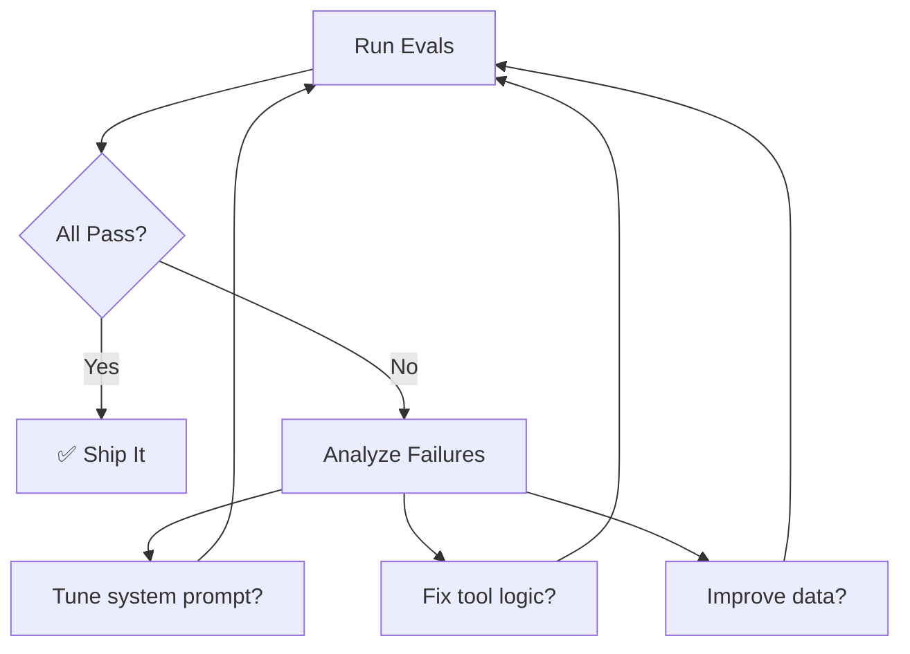

# AI Evaluations — Voice-First AI Property Scout

Detailed specifications for the 3 required AI evaluations. Each eval is independently runnable via CLI and produces a structured JSON report.

**Run all evals:**
```bash
python evals/run_evals.py --eval all
```

**Run a specific eval:**
```bash
python evals/run_evals.py --eval feasibility
python evals/run_evals.py --eval edit
python evals/run_evals.py --eval grounding
```

---

## 1. Feasibility Eval

**Purpose:** Verify that the shortlist respects the user's stated budget, must-have amenities, and commute constraints.

**Type:** Rule-based (deterministic, no LLM needed)

### What It Checks

| Check | Rule | Pass Condition |
|-------|------|----------------|
| **Budget compliance** | Every shortlisted listing's rent ≤ stated `max_budget` | 100% of listings within budget |
| **Bedroom match** | Every shortlisted listing has ≥ `min_bedrooms` | 100% of listings meet bedroom requirement |
| **Must-have amenities** | Every shortlisted listing contains all items in `must_have_amenities` | 100% of listings have all required amenities |
| **Neighborhood match** | If user specified a neighborhood, all listings are in that neighborhood | 100% of listings in correct neighborhood |
| **Availability** | Every shortlisted listing is marked `available` (not `not_for_rent`) | 100% available |
| **Commute consistency** | If commute claims are made (e.g. "15 min to MG Road"), they are consistent with MCP distance data | No contradictory commute claims |

### Test Cases

#### Test 1: Basic Budget + Bedroom Compliance
```json
{
    "test_id": "feasibility_001",
    "description": "2BHK under 35k in Koramangala with parking",
    "input": {
        "budget_max": 35000,
        "bedrooms": 2,
        "neighborhood": "Koramangala",
        "must_have_amenities": ["parking"]
    },
    "assertions": [
        {"type": "all_within_budget", "budget": 35000},
        {"type": "all_min_bedrooms", "bedrooms": 2},
        {"type": "all_in_neighborhood", "neighborhood": "Koramangala"},
        {"type": "all_have_amenities", "amenities": ["parking"]},
        {"type": "all_available"}
    ]
}
```

#### Test 2: Strict Budget with Multiple Amenities
```json
{
    "test_id": "feasibility_002",
    "description": "1BHK under 20k in HSR Layout with gym and power backup",
    "input": {
        "budget_max": 20000,
        "bedrooms": 1,
        "neighborhood": "HSR Layout",
        "must_have_amenities": ["gym", "power_backup"]
    },
    "assertions": [
        {"type": "all_within_budget", "budget": 20000},
        {"type": "all_min_bedrooms", "bedrooms": 1},
        {"type": "all_in_neighborhood", "neighborhood": "HSR Layout"},
        {"type": "all_have_amenities", "amenities": ["gym", "power_backup"]},
        {"type": "all_available"}
    ]
}
```

#### Test 3: Cross-Neighborhood Search (No Neighborhood Filter)
```json
{
    "test_id": "feasibility_003",
    "description": "3BHK under 50k, any neighborhood, with parking and balcony",
    "input": {
        "budget_max": 50000,
        "bedrooms": 3,
        "neighborhood": null,
        "must_have_amenities": ["parking", "balcony"]
    },
    "assertions": [
        {"type": "all_within_budget", "budget": 50000},
        {"type": "all_min_bedrooms", "bedrooms": 3},
        {"type": "all_have_amenities", "amenities": ["parking", "balcony"]},
        {"type": "all_available"}
    ]
}
```

#### Test 4: Zero-Result Scenario
```json
{
    "test_id": "feasibility_004",
    "description": "Impossible criteria — should return 0 listings and say so",
    "input": {
        "budget_max": 5000,
        "bedrooms": 3,
        "neighborhood": "Koramangala",
        "must_have_amenities": ["swimming_pool", "gym", "parking"]
    },
    "assertions": [
        {"type": "empty_shortlist"},
        {"type": "response_acknowledges_no_results"}
    ]
}
```

#### Test 5: Budget Boundary (Exact Match)
```json
{
    "test_id": "feasibility_005",
    "description": "Budget set to exact rent of a listing — should include it",
    "input": {
        "budget_max": 30000,
        "bedrooms": 2,
        "neighborhood": "Indiranagar",
        "must_have_amenities": []
    },
    "assertions": [
        {"type": "all_within_budget", "budget": 30000},
        {"type": "includes_listing_at_exact_budget", "budget": 30000}
    ]
}
```

### Implementation Logic

```python
def run_feasibility_eval(test_case, shortlist, listings_db):
    results = []
    for assertion in test_case["assertions"]:
        if assertion["type"] == "all_within_budget":
            passed = all(l["rent"] <= assertion["budget"] for l in shortlist)
            failures = [l["id"] for l in shortlist if l["rent"] > assertion["budget"]]
            results.append({"assertion": assertion, "passed": passed, "failures": failures})
        
        elif assertion["type"] == "all_have_amenities":
            for amenity in assertion["amenities"]:
                passed = all(amenity in l["amenities"] for l in shortlist)
                failures = [l["id"] for l in shortlist if amenity not in l["amenities"]]
                results.append({"assertion": f"has_{amenity}", "passed": passed, "failures": failures})
        
        elif assertion["type"] == "all_available":
            passed = all(l["availability"] == "available" for l in shortlist)
            failures = [l["id"] for l in shortlist if l["availability"] != "available"]
            results.append({"assertion": assertion, "passed": passed, "failures": failures})
        # ... more assertion types
    
    return {"test_id": test_case["test_id"], "passed": all(r["passed"] for r in results), "results": results}
```

### Scoring

| Metric | Calculation |
|--------|-------------|
| **Per-test pass rate** | assertions_passed / total_assertions |
| **Overall pass rate** | tests_fully_passed / total_tests |
| **Target** | 100% (all assertions must pass) |

---

## 2. Edit Correctness Eval

**Purpose:** Verify that voice refinement commands modify only the intended parts of the shortlist — no unintended additions, removals, or mutations.

**Type:** Rule-based + LLM-assisted (for intent verification)

### What It Checks

| Check | Rule | Pass Condition |
|-------|------|----------------|
| **Correct removals** | After "drop above X", no listing with rent > X remains | Zero violations |
| **No unintended removals** | Listings that should survive the edit are still present | All expected listings present |
| **No unintended additions** | No new listings appear that weren't in the original shortlist (unless explicitly requested) | Zero surprise additions |
| **Data integrity** | Surviving listings are byte-identical before and after the edit | Zero mutations |
| **Filter specificity** | Only the stated criterion is applied — other attributes remain unchanged | No side-effect filters |

### Test Cases

#### Test 1: Budget Ceiling Edit
```json
{
    "test_id": "edit_001",
    "description": "Drop anything above 30k",
    "setup": {
        "initial_query": "2BHK in Koramangala under 40k",
        "initial_shortlist_budget_range": [25000, 38000]
    },
    "edit_command": "Drop anything above 30k",
    "assertions": [
        {"type": "all_within_budget", "budget": 30000},
        {"type": "no_unintended_removals", "condition": "rent <= 30000"},
        {"type": "no_new_additions"},
        {"type": "surviving_listings_unchanged"}
    ]
}
```

#### Test 2: Amenity Addition Filter
```json
{
    "test_id": "edit_002",
    "description": "Only show pet-friendly places",
    "setup": {
        "initial_query": "2BHK in Koramangala under 35k"
    },
    "edit_command": "I need something pet-friendly",
    "assertions": [
        {"type": "all_have_amenities", "amenities": ["pet_friendly"]},
        {"type": "no_unintended_removals", "condition": "has pet_friendly amenity"},
        {"type": "no_new_additions"},
        {"type": "surviving_listings_unchanged"}
    ]
}
```

#### Test 3: Add More Options
```json
{
    "test_id": "edit_003",
    "description": "Add one more option with a balcony",
    "setup": {
        "initial_query": "2BHK in Koramangala under 35k"
    },
    "edit_command": "Add one more option with a balcony",
    "assertions": [
        {"type": "previous_listings_preserved"},
        {"type": "exactly_one_new_addition"},
        {"type": "new_listing_has_amenity", "amenity": "balcony"},
        {"type": "new_listing_within_original_constraints"}
    ]
}
```

#### Test 4: Sequential Edits
```json
{
    "test_id": "edit_004",
    "description": "Two edits in sequence — budget cut then amenity filter",
    "setup": {
        "initial_query": "2BHK under 40k"
    },
    "edits": [
        {
            "command": "Drop anything above 35k",
            "assertions": [
                {"type": "all_within_budget", "budget": 35000},
                {"type": "no_unintended_removals", "condition": "rent <= 35000"}
            ]
        },
        {
            "command": "Only show places with parking",
            "assertions": [
                {"type": "all_within_budget", "budget": 35000},
                {"type": "all_have_amenities", "amenities": ["parking"]},
                {"type": "no_unintended_removals", "condition": "rent <= 35000 AND has parking"}
            ]
        }
    ]
}
```

#### Test 5: Redundant Edit (No-Op)
```json
{
    "test_id": "edit_005",
    "description": "Apply a filter that's already satisfied — shortlist should not change",
    "setup": {
        "initial_query": "2BHK under 30k in Koramangala"
    },
    "edit_command": "Only show places under 40k",
    "assertions": [
        {"type": "shortlist_unchanged"},
        {"type": "response_acknowledges_no_change"}
    ]
}
```

### Implementation Logic

```python
def run_edit_eval(test_case, orchestrator):
    # Step 1: Generate initial shortlist
    session = create_session()
    initial_response = orchestrator.process(session, test_case["setup"]["initial_query"])
    shortlist_before = deepcopy(initial_response["shortlist"])
    
    # Step 2: Apply edit command
    edit_response = orchestrator.process(session, test_case["edit_command"])
    shortlist_after = edit_response["shortlist"]
    
    # Step 3: Run assertions
    results = []
    for assertion in test_case["assertions"]:
        if assertion["type"] == "no_unintended_removals":
            expected_survivors = [l for l in shortlist_before if eval_condition(l, assertion["condition"])]
            actual_survivor_ids = {l["id"] for l in shortlist_after}
            missing = [l["id"] for l in expected_survivors if l["id"] not in actual_survivor_ids]
            results.append({"assertion": assertion, "passed": len(missing) == 0, "missing": missing})
        
        elif assertion["type"] == "surviving_listings_unchanged":
            for listing in shortlist_after:
                original = next((l for l in shortlist_before if l["id"] == listing["id"]), None)
                if original:
                    is_same = listing == original  # deep equality
                    if not is_same:
                        results.append({"assertion": assertion, "passed": False, "mutated": listing["id"]})
            results.append({"assertion": assertion, "passed": True})
        
        elif assertion["type"] == "no_new_additions":
            original_ids = {l["id"] for l in shortlist_before}
            new_ids = {l["id"] for l in shortlist_after} - original_ids
            results.append({"assertion": assertion, "passed": len(new_ids) == 0, "new_ids": list(new_ids)})
    
    return {"test_id": test_case["test_id"], "passed": all(r["passed"] for r in results), "results": results}
```

### Diff Output

For each edit, the eval produces a diff showing exactly what changed:

```
=== Edit: "Drop anything above 30k" ===

BEFORE (4 listings):
  ✓ listing_001  Prestige Ozone     ₹25,000  2BHK  Koramangala
  ✓ listing_003  Sobha Dream Acres  ₹28,000  2BHK  Koramangala
  ✗ listing_007  Brigade Gateway    ₹35,000  2BHK  Koramangala  [REMOVED: rent > 30000]
  ✗ listing_012  Purva Venezia      ₹38,000  2BHK  Koramangala  [REMOVED: rent > 30000]

AFTER (2 listings):
  ✓ listing_001  Prestige Ozone     ₹25,000  2BHK  Koramangala  [UNCHANGED ✓]
  ✓ listing_003  Sobha Dream Acres  ₹28,000  2BHK  Koramangala  [UNCHANGED ✓]

RESULT: ✅ PASS — 2 correct removals, 0 unintended removals, 0 mutations
```

### Scoring

| Metric | Calculation |
|--------|-------------|
| **Correct removal rate** | correctly_removed / should_be_removed |
| **Unintended removal rate** | incorrectly_removed / should_survive (target: 0%) |
| **Mutation rate** | mutated_listings / surviving_listings (target: 0%) |
| **Overall pass rate** | tests_fully_passed / total_tests |

---

## 3. Grounding & Hallucination Eval

**Purpose:** Verify that all neighborhood claims are grounded in RAG sources with citations, and that the system does not hallucinate facts.

**Type:** LLM-assisted (uses an evaluator LLM to extract and verify claims)

### What It Checks

| Check | Rule | Pass Condition |
|-------|------|----------------|
| **Citation presence** | Every neighborhood claim in the response has a corresponding citation | 100% cited |
| **Citation accuracy** | Each citation maps to an actual RAG chunk that supports the claim | 100% accurate |
| **Listing grounding** | Every shortlisted listing maps to a record in the dataset | 100% grounded |
| **Availability accuracy** | Every shortlisted listing is marked as `available` in the dataset | 100% available |
| **Uncertainty disclosure** | When data is missing, the assistant says so (doesn't guess) | 100% honest |
| **No fabricated facts** | No specific claims (stats, distances, names) that can't be verified | Zero fabrications |

### What Counts as a "Claim"

A claim is any **specific factual assertion** about a neighborhood, including:
- Safety statements ("Koramangala is generally safe at night")
- Transit information ("The nearest metro is 2km away")
- Amenity descriptions ("There are several restaurants on 80 Feet Road")
- Character descriptions ("It's a popular area for young professionals")
- Historical facts ("Koramangala was originally an industrial area")

**Not claims** (excluded from eval):
- Generic filler ("This is a great area")
- User preference echoes ("You wanted 2BHK under 35k")
- Listing data from the database (rent, bedrooms — these are structured data, not claims)

### Test Cases

#### Test 1: Standard Neighborhood Explanation
```json
{
    "test_id": "grounding_001",
    "description": "User asks about Koramangala — all claims should be cited",
    "conversation": [
        {"role": "user", "text": "2BHK in Koramangala under 35k"},
        {"role": "user", "text": "What's Koramangala actually like to live in?"}
    ],
    "assertions": [
        {"type": "all_claims_cited"},
        {"type": "citations_map_to_rag_chunks"},
        {"type": "no_fabricated_statistics"}
    ]
}
```

#### Test 2: Safety Question
```json
{
    "test_id": "grounding_002",
    "description": "User asks about safety — must use RAG, not general knowledge",
    "conversation": [
        {"role": "user", "text": "2BHK in Indiranagar under 40k"},
        {"role": "user", "text": "Is Indiranagar safe at night?"}
    ],
    "assertions": [
        {"type": "all_claims_cited"},
        {"type": "no_claims_without_source"},
        {"type": "safety_claims_from_rag_not_llm"}
    ]
}
```

#### Test 3: Unknown Neighborhood (Missing Data)
```json
{
    "test_id": "grounding_003",
    "description": "User asks about a neighborhood we don't have RAG data for",
    "conversation": [
        {"role": "user", "text": "What's Whitefield like?"}
    ],
    "assertions": [
        {"type": "response_admits_no_data"},
        {"type": "no_fabricated_claims_about", "neighborhood": "Whitefield"},
        {"type": "suggests_known_neighborhoods"}
    ]
}
```

#### Test 4: Listing-Level Grounding
```json
{
    "test_id": "grounding_004",
    "description": "Every shortlisted listing ID must exist in the database and be available",
    "conversation": [
        {"role": "user", "text": "Show me 2BHK places in HSR Layout under 30k"}
    ],
    "assertions": [
        {"type": "all_listing_ids_exist_in_db"},
        {"type": "all_listings_marked_available"},
        {"type": "listing_details_match_db"}
    ]
}
```

#### Test 5: Mixed Grounded and Ungrounded Request
```json
{
    "test_id": "grounding_005",
    "description": "User asks about a known area + a specific unknown aspect",
    "conversation": [
        {"role": "user", "text": "2BHK in Koramangala under 35k"},
        {"role": "user", "text": "What's the crime rate in Koramangala Block 5?"}
    ],
    "assertions": [
        {"type": "response_admits_specific_data_unavailable"},
        {"type": "offers_general_info_with_citation"},
        {"type": "no_fabricated_statistics"}
    ]
}
```

### Implementation Logic

```python
def run_grounding_eval(test_case, orchestrator, rag_store, listings_db):
    # Step 1: Replay conversation
    session = create_session()
    for turn in test_case["conversation"]:
        response = orchestrator.process(session, turn["text"])
    
    # Step 2: Extract claims using evaluator LLM
    claims = extract_claims_with_llm(response["response_text"])
    # Returns: [{"claim": "Koramangala is safe at night", "type": "safety", "specificity": "general"}]
    
    # Step 3: For each claim, check RAG grounding
    results = []
    for claim in claims:
        # Search RAG for supporting evidence
        rag_chunks = rag_store.query(claim["claim"], top_k=3)
        best_match = rag_chunks[0] if rag_chunks else None
        
        is_grounded = best_match and best_match["similarity"] > 0.75
        has_citation = claim_has_citation_in_response(claim, response["sources"])
        
        results.append({
            "claim": claim["claim"],
            "grounded": is_grounded,
            "cited": has_citation,
            "best_rag_match": best_match["text"][:100] if best_match else None,
            "similarity": best_match["similarity"] if best_match else 0,
            "source": best_match["metadata"]["source_url"] if best_match else None
        })
    
    # Step 4: Check listing grounding
    for listing in response.get("shortlist", []):
        db_record = listings_db.get(listing["id"])
        results.append({
            "type": "listing_grounding",
            "listing_id": listing["id"],
            "exists_in_db": db_record is not None,
            "is_available": db_record["availability"] == "available" if db_record else False,
            "data_matches": listing["rent"] == db_record["rent"] if db_record else False
        })
    
    # Step 5: Check uncertainty handling
    if test_case.get("expects_uncertainty"):
        admits_gap = uncertainty_detected_in_response(response["response_text"])
        results.append({"type": "uncertainty_disclosure", "passed": admits_gap})
    
    return {
        "test_id": test_case["test_id"],
        "total_claims": len(claims),
        "grounded_claims": sum(1 for r in results if r.get("grounded")),
        "cited_claims": sum(1 for r in results if r.get("cited")),
        "hallucinated_claims": [r for r in results if not r.get("grounded") and r.get("claim")],
        "passed": all(r.get("grounded", True) and r.get("cited", True) for r in results),
        "results": results
    }
```

### Claim Extraction Prompt (Evaluator LLM)

```
You are an evaluation assistant. Extract all specific factual claims about 
neighborhoods from the following assistant response. 

A "claim" is any specific factual assertion about a neighborhood, such as:
- Safety statements
- Transit information
- Amenity descriptions  
- Character descriptions
- Historical facts

Do NOT include:
- Generic filler ("great area")
- Echoes of user preferences
- Listing data (rent, bedrooms)

For each claim, output:
{"claim": "...", "type": "safety|transit|amenity|character|history", "neighborhood": "..."}

Response to evaluate:
{assistant_response}
```

### Scoring

| Metric | Calculation | Target |
|--------|-------------|--------|
| **Grounding rate** | grounded_claims / total_claims | 100% |
| **Citation rate** | cited_claims / total_claims | 100% |
| **Hallucination count** | claims with no RAG support | 0 |
| **Listing accuracy** | listings matching DB / total listings | 100% |
| **Uncertainty honesty** | correctly disclosed gaps / total gaps | 100% |
| **Overall score** | weighted average of above | ≥ 95% |

---

## Eval Report Format

Each eval run produces a JSON report saved to `evals/results/`:

```json
{
    "eval_name": "feasibility",
    "timestamp": "2026-09-10T14:30:00Z",
    "total_tests": 5,
    "passed": 4,
    "failed": 1,
    "pass_rate": 0.80,
    "details": [
        {
            "test_id": "feasibility_001",
            "passed": true,
            "assertions": [
                {"type": "all_within_budget", "passed": true, "failures": []},
                {"type": "all_have_amenities", "passed": true, "failures": []}
            ]
        },
        {
            "test_id": "feasibility_004",
            "passed": false,
            "assertions": [
                {"type": "empty_shortlist", "passed": false, "note": "Returned 1 listing that shouldn't match"}
            ]
        }
    ]
}
```

### Console Output

```
╔══════════════════════════════════════════════╗
║        AI Evaluation Results                 ║
╠══════════════════════════════════════════════╣
║ Eval: Feasibility                            ║
║ Tests: 5 | Passed: 4 | Failed: 1            ║
║ Pass Rate: 80%                               ║
╠══════════════════════════════════════════════╣
║ Eval: Edit Correctness                       ║
║ Tests: 5 | Passed: 5 | Failed: 0            ║
║ Pass Rate: 100%                              ║
╠══════════════════════════════════════════════╣
║ Eval: Grounding & Hallucination              ║
║ Tests: 5 | Passed: 5 | Failed: 0            ║
║ Pass Rate: 100%                              ║
║ Total Claims: 23 | Grounded: 23 | Cited: 23 ║
║ Hallucinations: 0                            ║
╠══════════════════════════════════════════════╣
║ OVERALL: 14/15 tests passed (93%)            ║
╚══════════════════════════════════════════════╝
```

---

## Iteration Strategy

After running evals, iterate on failures:



| Failure Type | Likely Fix |
|-------------|------------|
| Budget violations | Fix `listing_search.py` filter logic |
| Unintended removals on edit | Improve system prompt for refinement intent parsing |
| Missing citations | Strengthen grounding instruction in system prompt |
| Hallucinated claims | Add "NEVER make claims without RAG evidence" to prompt; lower similarity threshold |
| Listing not in DB | Verify orchestrator only returns IDs from search results, not fabricated ones |
| Didn't admit missing data | Add explicit prompt rule: "If you don't have data, say so" |
